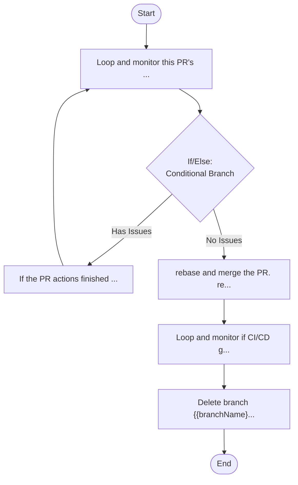

## Workflow Execution Guide

Follow the Mermaid flowchart above to execute the workflow. Each node type has specific execution methods as described below.

### Execution Methods by Node Type

- **Rectangle nodes (Sub-Agent: ...)**: Execute Sub-Agents
- **Diamond nodes (AskUserQuestion:...)**: Use the AskUserQuestion tool to prompt the user and branch based on their response
- **Diamond nodes (Branch/Switch:...)**: Automatically branch based on the results of previous processing (see details section)
- **Rectangle nodes (Prompt nodes)**: Execute the prompts described in the details section below

### Prompt Node Details

#### prompt_1773634120047(If the PR actions finished ...)

```
If the PR actions finished and there are any code review comments to address, spawn 2 subagents to verify if the issues should be fixed or are irrelevant. Use an `oracle` agent if needed. Fix all issues that are applicable, and then commit to {{branchName}} and push to the PR.
All the non applicable code review comments should be marked as Resolved on the PR and IMPORTANTLY: you should comment as a reply to the specific review comment on why this will not be done.
```

#### prompt_1773634681534(Loop and monitor this PR's ...)

```
Loop and monitor this PR's actions until it is all finished, either green of issues (github actions, any code review tasks running). Save the PR's branch name to {{branchName}}
```

#### prompt_1773634826059(rebase and merge the PR. re...)

```
rebase and merge the PR. rebase main from origin to get the new commits just merged.
```

#### prompt_1773634870798(Loop and monitor if CI/CD g...)

```
Loop and monitor if CI/CD github actions for this PR merge passes. If it fails, create a commit on main to fix it, (rebasing local so that the fix sits just above the last commit that failed the build - last commit of the merged PR) and push just that to main, and keep monitoring and doing this until build is green.
```

#### prompt_1773638367103(Delete branch {{branchName}...)

```
Delete branch {{branchName}} from remote and local.
```

### If/Else Node Details

#### ifelse_1773634264069(Binary Branch (True/False))

**Evaluation Target**: Look at the PR and check if there are any pending review comments to be addressed, or quality gates to be fixed..

**Branch conditions:**
- **No Issues**: No review comments to address
- **Has Issues**: Has review comments to address

**Execution method**: Evaluate the results of the previous processing and automatically select the appropriate branch based on the conditions above.
