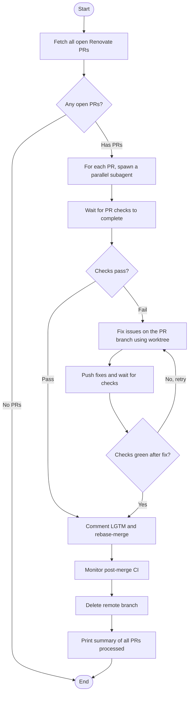

## Workflow Execution Guide

Follow the Mermaid flowchart above to execute the workflow. Each node type has specific execution methods as described below.

### Critical Rules

1. **NEVER checkout PR branches on the main worktree.** Multiple agents run in parallel — checking out branches would cause conflicts. Use `git worktree` or operate directly via `gh` CLI and `git push origin` with refspecs.
2. **All PR branch work uses isolated git worktrees** created with `git worktree add`.
3. **Agents run in parallel** — one subagent per PR, all spawned concurrently.
4. **Polling**: When waiting for checks, poll with `gh pr checks <number> --watch` or loop with `gh run list` every 30 seconds. Do not use `sleep` without a check command.

### Execution Methods by Node Type

- **Rectangle nodes**: Execute the prompts described in the details section below
- **Diamond nodes**: Automatically branch based on the results of previous processing

### Prompt Node Details

#### prompt_fetch_prs(Fetch all open Renovate PRs)

```
Fetch all open PRs authored by `renovate[bot]` using:
  gh pr list --author 'app/renovate' --state open --json number,title,headRefName,statusCheckRollup

Save the list of PRs to {{renovatePRs}}.
Print a summary: "Found N open Renovate PRs" with titles.
```

#### prompt_spawn_agents(For each PR, spawn a parallel subagent)

```
For each PR in {{renovatePRs}}, spawn a subagent in parallel using the Agent tool.
Each subagent handles one PR end-to-end (wait → fix → merge → cleanup).
The subagent prompt should include the full PR number, title, branch name, and the
instructions from prompt_wait_checks through prompt_cleanup below.

Use `isolation: "worktree"` so each agent works in its own git worktree — no branch
checkout conflicts. Each agent should use `mode: "bypassPermissions"` to avoid
blocking on permission prompts.

After all agents complete, continue to prompt_summary.
```

#### prompt_wait_checks(Wait for PR checks to complete)

```
For PR #{{prNumber}} (branch {{branchName}}):

1. Check if CI checks are still running:
   gh pr checks {{prNumber}}
2. If any checks are still pending/in_progress, poll every 30 seconds until all complete.
3. Once all checks have finished, record which checks passed and which failed.
   Save results to {{checkResults}}.
```

#### prompt_fix_issues(Fix issues on the PR branch using worktree)

```
For PR #{{prNumber}} with failed checks:

1. You are already in an isolated worktree. Checkout the PR branch:
   git checkout {{branchName}}
2. Analyze the failed checks from {{checkResults}} — read the logs:
   gh run view <runId> --log-failed
3. Identify the root cause (compile errors, lint failures, test failures, type errors).
4. Apply fixes directly to the code.
5. Run the relevant quality gates locally:
   pnpm codecheck
6. If codecheck passes, commit the fix:
   git add <files>
   git commit -m "fix: resolve CI failures in Renovate PR #{{prNumber}}"
7. Push the fix:
   git push origin {{branchName}}
```

#### prompt_push_wait(Push fixes and wait for checks)

```
After pushing fixes to {{branchName}}:

1. Wait for the new CI run to start (poll with `gh pr checks {{prNumber}}`).
2. Poll every 30 seconds until all checks complete.
3. If checks pass, continue to merge.
4. If checks fail again, loop back to prompt_fix_issues (max 3 attempts).
   After 3 failed attempts, comment on the PR explaining what was tried and
   skip this PR (do not merge).
```

#### prompt_comment_merge(Comment LGTM and rebase-merge)

```
For PR #{{prNumber}}:

1. If no fixes were needed, comment on the PR:
   gh pr comment {{prNumber}} --body "LGTM — all checks pass. Merging."
2. If fixes were applied, comment on the PR with a summary of what was fixed:
   gh pr comment {{prNumber}} --body "Fixed CI issues:\n- <list of fixes>\n\nAll checks now pass. Merging."
3. Merge the PR with rebase strategy:
   gh pr merge {{prNumber}} --rebase --delete-branch
```

#### prompt_post_merge_monitor(Monitor post-merge CI)

```
After merging PR #{{prNumber}}:

1. Check if the merge triggered a CI run on main:
   gh run list --branch main --limit 1
2. Monitor until complete. If it fails and the failure is related to the
   just-merged PR, note it in {{mergeResults}} but do NOT attempt to fix
   main directly — flag it for manual review.
```

#### prompt_cleanup(Delete remote branch)

```
The branch should already be deleted by --delete-branch in the merge step.
Verify cleanup:
  git worktree list — confirm no stale worktrees remain.
If the remote branch still exists:
  gh api -X DELETE repos/{owner}/{repo}/git/refs/heads/{{branchName}}
```

#### prompt_summary(Print summary of all PRs processed)

```
After all subagents complete, print a summary table:

| PR | Title | Status | Fixes Applied | Notes |
|----|-------|--------|---------------|-------|

Status should be one of: Merged, Skipped (max retries), Skipped (no fixes possible), Error.
Include any PRs that need manual attention.
```

### If/Else Node Details

#### ifelse_has_prs(Any open PRs?)

**Evaluation Target**: Check if {{renovatePRs}} contains any PRs.

**Branch conditions:**
- **No PRs**: List is empty — nothing to do
- **Has PRs**: One or more open Renovate PRs found

#### ifelse_checks_pass(Checks pass?)

**Evaluation Target**: Review {{checkResults}} for the PR.

**Branch conditions:**
- **Pass**: All checks passed — ready to merge as-is
- **Fail**: One or more checks failed — needs fixing

#### ifelse_fixed(Checks green after fix?)

**Evaluation Target**: Review check results after pushing fixes.

**Branch conditions:**
- **Yes**: All checks pass after fix — proceed to merge
- **No, retry**: Still failing — loop back to fix (up to 3 attempts)
