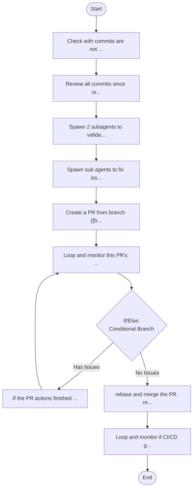

## Workflow Execution Guide

Follow the Mermaid flowchart above to execute the workflow. Each node type has specific execution methods as described below.

### Execution Methods by Node Type

- **Rectangle nodes (Sub-Agent: ...)**: Execute Sub-Agents
- **Diamond nodes (AskUserQuestion:...)**: Use the AskUserQuestion tool to prompt the user and branch based on their response
- **Diamond nodes (Branch/Switch:...)**: Automatically branch based on the results of previous processing (see details section)
- **Rectangle nodes (Prompt nodes)**: Execute the prompts described in the details section below

### Prompt Node Details

#### prompt_1773633117647(Check with commits are not ...)

```
Check with commits are not pushed to the remote, keep track of the latest commit as variable {{lastCommitSha}}.

Create a branch from origin/main until this last commit. But dont checkout that branch, continue with main checked out.

Save the name of the branch to {{branchName}}


```

#### prompt_1773633379381(Review all commits since or...)

```
Review all commits since origin/main that are in the branch {{branchName}}, up until {{lastCommitSha}}.

To review it, follow:

Run a comprehensive code review by spawning all 6 specialist agents in parallel.

## Process

1. Determine the diff to review:
   - If argument provided: `git diff $ARGUMENTS`
   - Otherwise: combine `git diff` and `git diff --cached`
2. If there are no changes, tell the user there is nothing to review and stop.
3. Get the diff content and the list of changed files.
4. Read all 6 agent files from `.claude/agents/`:
   - `engineer.md`
   - `security-expert.md`
   - `sre-engineer.md`
   - `software-architect.md`
   - `compliance-specialist.md`
   - `devops-engineer.md`
5. Spawn **all 6 agents in parallel** using the Task tool. Each agent uses the `model` declared in its frontmatter. Pass the full agent file content as the system prompt and the diff + file list as the task. Use `subagent_type` matching the agent name.
6. Wait for all agents to complete, then present the unified report.

### 1. Status Banner

Start with a one-line status. Use the worst status across all agents:

- All pass → `All 6 reviewers passed — no issues found.`
- Any warn → `Review complete — warnings found (no blocking issues).`
- Any fail → `Review complete — blocking issues found.`

### 2. Summary Table

```markdown
| Reviewer              | Status   | Blocking | Warning | Nit |
| --------------------- | -------- | -------- | ------- | --- |
| Engineer              | ✅/⚠️/❌ | 0        | 0       | 0   |
| Security Expert       | ✅/⚠️/❌ | 0        | 0       | 0   |
| SRE Engineer          | ✅/⚠️/❌ | 0        | 0       | 0   |
| Software Architect    | ✅/⚠️/❌ | 0        | 0       | 0   |
| Compliance Specialist | ✅/⚠️/❌ | 0        | 0       | 0   |
| DevOps Engineer       | ✅/⚠️/❌ | 0        | 0       | 0   |
```

Status icons: `✅` = pass, `⚠️` = warn (non-blocking only), `❌` = fail (has blocking issues).

### 3. Blocking Issues First

If ANY reviewer has blocking issues, show them immediately after the table — no collapsing, no hiding:

```markdown
---

## Blocking Issues

### 🔒 Security Expert

**`src/auth.ts:42`** — Hardcoded API key in source (CWE-798)

> Move to environment variable or secrets manager.

### 🔍 Engineer

**`src/api.ts:88`** — Unhandled promise rejection will crash the process

> Wrap in try/catch and return appropriate error response.
```

Group by reviewer. Each finding shows: file:line, one-line description, and the suggestion as a blockquote.

### 4. Warnings and Nits (Collapsed)

After blocking issues (or after the summary table if none), show remaining findings collapsed per reviewer:

```markdown
---

<details>
<summary>⚠️ Warnings (N total across all reviewers)</summary>

### 🔍 Engineer (N warnings)

- **`src/db.ts:15`** — N+1 query pattern in user fetch loop
- **`src/handler.ts:33`** — Missing timeout on external API call

### 🏗️ SRE Engineer (N warnings)

- **`src/service.ts:22`** — No circuit breaker on payment gateway call

</details>

<details>
<summary>💅 Nits (N total across all reviewers)</summary>

### 🔍 Engineer (N nits)

- **`src/utils.ts:7`** — Variable `data` could be more descriptive

</details>
```

### 5. Per-Reviewer Deep Dive (Collapsed)

Finally, include each reviewer's full markdown report collapsed for those who want the complete analysis:

```markdown
---

<details>
<summary>📋 Full report: Engineer</summary>

<the reviewer's complete markdown output including walkthrough, changes table, and all findings>

</details>

<details>
<summary>📋 Full report: Security Expert</summary>

...

</details>
```

## Formatting Rules

- **Blocking issues are never hidden.** They appear expanded, right after the summary table.
- **Warnings and nits are collapsed** to keep the initial view scannable.
- **Reviewers with zero findings** get a single line in the summary table and nothing else — no empty sections.
- **File paths use backtick formatting** with line numbers: `` `src/file.ts:42` ``
- **No JSON in the final output.** The JSON reports are internal; only the formatted markdown is shown to the user.
- **Horizontal rules** (`---`) separate the major sections for visual clarity in the terminal.

## Constraints

- Do not push or commit anything.
- If no changes exist, report that there is nothing to review.
- Do not ask the user which reviewers to run — this command always runs all 6.
```

#### prompt_1773633669162(Spawn 2 subagents to valida...)

```
Spawn 2 subagents to validate if the review items flagged are relevant to the current state of the codebase, or if too early for some of the concerns, or if that was intended, behavior, things like that. Then check with an `oracle` agent to validate which items should be fixed. Output the list of items to be fixed right now.
```

#### prompt_1773633786952(Spawn sub agents to fix iss...)

```
Spawn sub agents to fix issues flagged as needed, as as they can be executed in parallel. Commit the changes (rebasing main so that new commits made here, go after {{lastCommitSha}} and make sure the branch {{branchName}} includes these commits.

Make sure to invalidate nx cache and run quality gates: pnpm codecheck at project root.
```

#### prompt_1773633932720(Create a PR from branch {{b...)

```
Create a PR from branch {{branchName}} and open a PR for it.
```

#### prompt_1773634120047(If the PR actions finished ...)

```
If the PR actions finished and there are any code review comments to address, spawn 2 subagents to verify if the issues should be fixed or are irrelevant. Use an `oracle` agent if needed. Fix all issues that are applicable, and then commit to {{branchName}} and push to the PR.
```

#### prompt_1773634681534(Loop and monitor this PR's ...)

```
Loop and monitor this PR's actions until it is all finished, either green of issues (github actions, any code review tasks running).
```

#### prompt_1773634826059(rebase and merge the PR. re...)

```
rebase and merge the PR. rebase main from origin to get the new commits just merged.
```

#### prompt_1773634870798(Loop and monitor if CI/CD g...)

```
Loop and monitor if CI/CD github actions for this PR merge passes. If it fails, create a commit on main to fix it, (rebasing local so that the fix sits just above the last commit that failed the build - last commit of the merged PR) and push just that to main, and keep monitoring and doing this until build is green.
```

### If/Else Node Details

#### ifelse_1773634264069(Binary Branch (True/False))

**Evaluation Target**: Look at the PR and check if there are any pending review comments to be addressed, or quality gates to be fixed..

**Branch conditions:**
- **No Issues**: No review comments to address
- **Has Issues**: Has review comments to address

**Execution method**: Evaluate the results of the previous processing and automatically select the appropriate branch based on the conditions above.
